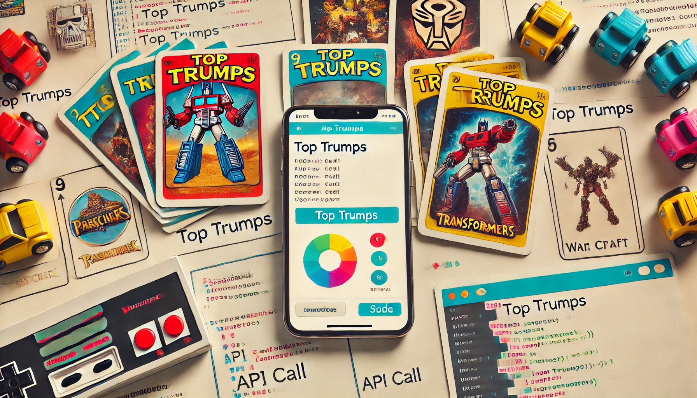
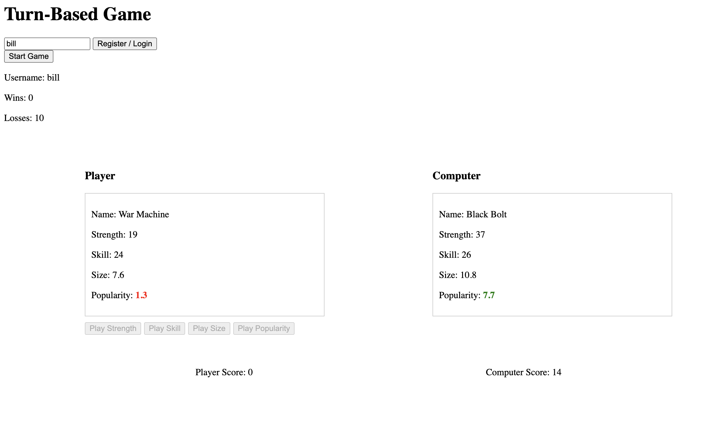

# Taming a Top Trumps API: Turning a Quirky API into a Game for Old School Players

Recently I have been tasked with writing API documentation for a game based on the classic Top Trumps card game...I may be showing my age with that enthusiastic reference. At the weekend, I went away with some friends and ended up playing a Pokémon trading card game with my mate's little boy Charlie. There were some surprising similarities between the API game and the game I played with Charlie. Like the API game, Charlie's game didn't have a set "win" state, Charlie's cards never seemed to run out and absolutely on par with the API game, Charlie's game didn't end unless he won. While playing by a child's idea of how the rules of the game should work (incidentally....Charlie always wins) can be endearing, I thought that the API game could be improved. So I decided to do this and put this tutorial together to show you how.

The Game API
The Game API can be found on GitHub here https://github.com/dataiku/DA-technical-test. I won’t go over how to install it and run it, since this is covered in the documentation there. But if you want to try out what is covered in this tutorial, you will need to have a copy of this.

Issues with the Game
I briefly touched upon the issues with the game, but here is a more thorough explanation.

1. There is never a "win" state – Both the “player” and the “computer” can endlessly “buy cards”. So the game will go on forever.
2. There is no built-in card counting mechanism for the “computer” that is exposed by the API – The game actually randomly generates cards for each of the rounds.
3. There is no mechanism to reveal the “computer’s” card – Not immediately obvious as a problem, but we will talk about this later.
3. The “computer” doesn’t have the ability to initiate a turn – It is the player who picks the card attribute and initiates every round.
4. The playerId is easily lost and records cannot be stored – every call to the API (apart from the “ping” endpoint and “register” endpoint) requires the playerId. 
6. The only way to play this is to manually call the APIs

The purpose of this tutorial
In this tutorial we will produce a user interface to this API and will attempt to fix the issues mentioned above. The game will be able to be played by anyone who can use a webpage. It will be turn based, in that both the player and the computer will be able to initiate a round (pick the card attribute to compete with). Player data will be stored between sessions of the game without the user needing to remember anything but their username. There will be a “win” state, when the player or the computer has 14 cards. The computer still won’t be able to see it’s card, but a mechanism will be put in place to ensure that the computer is competitive. This will be a basic method which actually will benefit the computer more than the player, but this can be modified and I’ll be interested to hear your methods for this…I have a few in mind already.

Now before I continue on into an overly verbose description of what we’re doing, let’s begin. Oh, I forgot to mention, I will make all of the source code available for this. But even if you download it and run it, please make sure to continue reading so that everything is explained. You can download it from….you’ll find out later ;-) 

The API Client
Now, this is an API game. You could go about playing this by manually calling the API endpoints, but that would be terribly fiddly and I’ll be honest, the game isn’t that exciting that it would be worth the effort. You could also write the code to interact with the endpoints yourself…it’s not that difficult. But I have put together a simple “client” you can use to make this easier. This can be seen below (calling it a “client” is a bit of a stretch, but indulge me for this)…
```javascript

        // Set the Base URL for API calls        
        const baseUrl = 'http://localhost:4000';

        // Sends a GET request to check the status of the cards endpoint
        async function ping() {
            const url = `${baseUrl}/cards`;
            const headers = { 'Content-Type': 'application/json' };
            return fetchData(url, 'GET', headers, null);
        }

        // Registers a new user with a given username, birthdate, and email
        async function register(username, birthdate, email) {
            const url = `${baseUrl}/register`;
            const headers = { 'Content-Type': 'application/json' };
            const requestBody = { username, birthdate, email };
            return fetchData(url, 'POST', headers, requestBody);
        }

        // Retrieves the profile data of a player based on their playerId
        async function profile(playerId) {
            const url = `${baseUrl}/profile`;
            const headers = { 'Content-Type': 'application/json', 'playerid': playerId };
            return fetchData(url, 'GET', headers, null);
        }

        // Requests the next card in the player's deck by playerId
        async function nextCard(playerId) {
            const url = `${baseUrl}/next-card`;
            const headers = { 'Content-Type': 'application/json', 'playerid': playerId };
            return fetchData(url, 'GET', headers, null);
        }

        // Initiates a battle using a specific field (e.g., 'strength') for a player
        async function battle(playerId, field) {
            const url = `${baseUrl}/battle`;
            const headers = { 'Content-Type': 'application/json', 'playerid': playerId };
            const requestBody = { field };
            return fetchData(url, 'POST', headers, requestBody);
        }

        // Retrieves a list of all cards for the given playerId
        async function listCards(playerId) {
            const url = `${baseUrl}/cards`;
            const headers = { 'Content-Type': 'application/json', 'playerid': playerId };
            return fetchData(url, 'GET', headers, null);
        }

        // Buys a new card for the player, adding it to their deck
        async function buyCard(playerId) {
            const url = `${baseUrl}/buy-card`;
            const headers = { 'Content-Type': 'application/json', 'playerid': playerId };
            return fetchData(url, 'GET', headers, null);
        }

        // Helper function to perform fetch requests with error handling
        async function fetchData(url, method, headers, bodyJson) {
            const body = bodyJson ? JSON.stringify(bodyJson) : null;
            try {
                const response = await fetch(url, { method, headers, body });
                const data = await response.json();

                // If response is not OK, throw an error with status and message
                if (!response.ok) {
                    throw { status: response.status, message: JSON.stringify(data) };
                }

                // Return status and data on success
                return { status: response.status, data };
            } catch (error) {
                // Return error details in case of failure
                return { status: error.status || '-', error: error.message || 'Unknown error' };
            }
        }
```


Normally this code would be in its own Javascript file and be imported into the project that you are putting together. However, since this tutorial is just going to be creating a web page to be run on your local machine, I will be including this in the web page. I didn’t want to dissuade you from trying this out by making you set up a webserver with CORS (Cross-Origin Resource Sharing) configured, but if you are happy doing this, you can easily extrapolate from what I am going to show you here.

This client provides a function for each of the endpoints that the API provides. It allows you to simply call the function with the required parameters and have the data returned as JSON. Since we are will be using Javascript in the webpage, this makes it very easy to acquire the data we will need. Using JSON with JavaScript is a bit like watching Ayrton Senna race at Monaco—at first, it looks complex, but when you see it in action, you’re left wondering how it could ever be so easy. Sorry, I'm an unapologetic F1 fan...so not sorry ;-)

To learn about the API you can see my documentation for it in GitHub here: https://github.com/rilhia/dataiku-test.

Creating the HTML
OK first, this is not going to be pretty. For this example, the “look and feel” aren’t really a top priority for me. Put it this way, if I were designing cars, I wouldn’t be dealing with the aesthetics. So what we have here is going to be a very basic and very simple UI. However, it should be simple enough for you to build upon if you so wish. The UI we will end up with will look like this…



 
…as I said, not pretty. But you should get the drift of what we are going for and maybe how you can think of improving upon it.

The HTML for this can be seen below…

```html


<!DOCTYPE html>
<html lang="en">

<head>
    <meta charset="UTF-8">
    <title>Top Trumps Game</title>
    <style>

       //Style code here

    </style>
</head>

<body>
    <h1>Turn-Based Game</h1>

    <!-- Username Input Section -->
    <div id="registration-section">
        <input type="text" id="username" placeholder="Enter your username" />
        <button onclick="handleRegistration()">Register / Login</button>
    </div>

    <!-- Start Game Button (Hidden initially) -->
    <button id="start-game-button" onclick="startGame()" style="display: none;">Start Game</button>

    <div id="player-record">
        <p id="username-display">Username: <span id="player-record-username"></span></p>
        <p>Wins: <span id="wins-display">0</span></p>
        <p>Losses: <span id="losses-display">0</span></p>
    </div>

    <div id="game-container">
        <div class="top-section">
            <div class="section" id="player-section">
                <h3>Player</h3>
                <div id="player-card">Loading your card...</div>
                <div class="buttons">
                    <button onclick="makeMove('strength')" class="move-button">Play Strength</button>
                    <button onclick="makeMove('skill')" class="move-button">Play Skill</button>
                    <button onclick="makeMove('size')" class="move-button">Play Size</button>
                    <button onclick="makeMove('popularity')" class="move-button">Play Popularity</button>
                    <button id="next-card-button" onclick="nextTurn()" style="display:none;">Next Card</button>
                </div>
            </div>
            <div class="section" id="computer-section">
                <h3>Computer</h3>
                <div id="computer-card">Waiting for player move...</div>
            </div>
        </div>
        <div class="score-section">
            <p>Player Score: <span id="player-score">7</span></p>
            <p>Computer Score: <span id="computer-score">7</span></p>
        </div>
    </div>


    <script>
      //Javascript goes here

    </script>
</body>

</html>
```

You may have noticed that I am calling Javascript functions directly from the HTML. Yes, this is somewhat antiquated. However, it saves on a fair amount of listener code and it works for this use case.

In the text above you will see the “//Style code here” in green at the top. The following code goes here. Why didn’t I include it in the code above? Well, this is different code. It is CSS. But to be perfectly honest it was because I am writing this in Word and Word really doesn’t handle code particularly well. So, I thought I would separate it. You can see the CSS below…
```CSS

 				#game-container {
            display: flex;
            flex-direction: column;
            width: 80%;
            margin: auto;
            margin-top: 50px;
            position: relative;
            min-height: 400px;
            justify-content: space-between;
        }

        .top-section {
            display: flex;
            justify-content: space-between;
            align-items: flex-start;
            width: 100%;
        }

        .section {
            width: 40%;
            margin: 10px;
        }

        #player-card,
        #computer-card {
            border: 1px solid #ccc;
            padding: 10px;
        }

        .buttons {
            display: flex;
            gap: 5px;
            margin-top: 10px;
        }

        .score-section {
            display: flex;
            justify-content: space-around;
            width: 100%;
            position: absolute;
            bottom: 0;
            padding-top: 20px;
        }

        .highlight-win {
            color: green;
            font-weight: bold;
        }

        .highlight-lose {
            color: red;
            font-weight: bold;
        }

        .highlight-draw {
            color: blue;
            font-weight: bold;
        }
```


As you can see, it is very limited and very basic. Simply copy this and paste between the style tags (<style> -->code<-- </style>).

There was also another piece of text in green in the HTML code. This is where the Javascript goes. The “client” code, that I mentioned above, will go here. But there is also a fair amount more. I will go through this a feature at a time in the order that it should be added. There may be a degree of cross-referencing that is required here.

1. Global Variables:

	•	playerScore & computerScore: These variables essentially count the cards possessed by the player and computer. The game is set up to start with both having 7. During the game, a win for one will add 1 to the score and subtract 1 from the other’s score. 
	•	playerData: This is a JSON object that holds the player’s information retrieved from either the local storage or through registration (to be added to the local storage). It contains the player’s ID, the player’s username and game the win/loss records.
	•	turn: This variable holds whose turn it is, either "player" or "computer". It alternates after each move to manage game flow. The “player” always starts at game.

This goes at the top of the script section.
```javascript
        // Game variables
        let playerScore = 7;
        let computerScore = 7;
        let playerData;
        let turn = "player";
```


2. handleRegistration():

	•	This function handles the login or registration process. It first checks if the player is already registered by searching the local storage for the username entered in the input field.
	•	If the player exists, it retrieves their data and displays the “Start Game” button.
	•	If the player doesn’t exist, the function registers the user with an API call (register()), generating a playerId. The data is then stored using savePlayer().
	•	Finally, it disables the move buttons (enableButtons(false)) to prevent interactions before starting the game.
```javascript

        // Function for handling registration and login
        function handleRegistration() {
            (async () => {
                const username = document.getElementById('username').value;
                if (!username) {
                    alert("Please enter a username");
                    return;
                }

                // Retrieve player from local storage
                playerData = getPlayer(username);

                if (playerData) {
                    //playerId = playerData.playerId;
                    document.getElementById('start-game-button').style.display = 'block';
                } else {
                    // Hard code birthday and email for simplicity
                    const birthdate = '2000-01-01';
                    const email = `${username.toLowerCase()}@example.com`;

                    // Register a new player if not found in local storage
                    const { data } = await register(username, birthdate, email);
                    //playerId = data.playerID;
                    playerData = savePlayer(data.playerId, username);
                    document.getElementById('start-game-button').style.display = 'block';
                }

                // Display the player record
                displayPlayerRecord(playerData);
            })();

            //Disable buttons
            enableButtons(false);
        }
```

3. getPlayer(username):

	•	This function searches the local storage for the player’s data based on their username.
	•	It retrieves the list of players stored in the browser’s local storage, searches for the specified player, and returns their data if found. Otherwise, it returns null.
	•	This function is essential for retrieving data when users return to the game or reload the page.

```javascript
        // Retrieve a player from local storage by username
        function getPlayer(username) {
            const players = JSON.parse(localStorage.getItem('players')) || [];
            return players.find(player => player.username === username) || null;
        }
```


4. savePlayer(playerId, username, wins = 0, losses = 0):

	•	This function stores or updates the player’s information in local storage.
	•	If the player already exists, their playerId, wins, and losses are updated. If they don’t exist, a new record is created.
	•	After updating or creating the player, it saves the updated player data back to the browser’s storage.

```javascript
        // Save or update player data in local storage
        function savePlayer(playerId, username, wins = 0, losses = 0) {
            const players = JSON.parse(localStorage.getItem('players')) || [];
            const playerIndex = players.findIndex(player => player.username === username);

            if (playerIndex !== -1) {
                // Update existing player
                players[playerIndex].playerId = playerId;
                players[playerIndex].wins = wins;
                players[playerIndex].losses = losses;
            } else {
                // Add new player
                players.push({ playerId, username, wins, losses });
            }

            localStorage.setItem('players', JSON.stringify(players));
            return players.find(player => player.username === username);
        }
```


5. updatePlayerRecord(username, win = false):

	•	This function updates the player’s win/loss record after each game.
	•	If the player wins the round, their win count is incremented. If they lose, their loss count is increased.
	•	The function then updates the player’s record in local storage and returns the updated player object.

```javascript
        // Update player record with wins/losses
        function updatePlayerRecord(username, win = false) {
            const players = JSON.parse(localStorage.getItem('players')) || [];
            const playerIndex = players.findIndex(player => player.username === username);

            if (playerIndex !== -1) {
                if (win) {
                    players[playerIndex].wins += 1;
                } else {
                    players[playerIndex].losses += 1;
                }
                localStorage.setItem('players', JSON.stringify(players));
            }
            return players[playerIndex];
        }
```


6. displayPlayerRecord(data):

	•	This function updates the player’s statistics (username, wins, losses) in the UI by modifying the HTML elements with the retrieved data.
	•	It’s triggered after registration or login, and after the game ends (when the win/loss count is updated).
```javascript
        // Display player record data
        function displayPlayerRecord(data) {
            if (data) {
                document.getElementById('player-record-username').innerText = data.username;
                document.getElementById('wins-display').innerText = data.wins;
                document.getElementById('losses-display').innerText = data.losses;
            }
        }
```

7. startGame():

	•	This function resets the game for both the player and the computer. It sets their scores back to 7 and ensures the player has at least 7 cards in their deck.
	•	The player’s score and the computer’s score are then updated in the UI.
	•	It also sets the turn variable to "player" and calls displayPlayerCard() to show the first card.
	•	Finally, the buttons are enabled to allow the player to make a move.

```javascript
        // Start a new game
        async function startGame() {
            playerScore = 7;
            computerScore = 7;

            let cards = await listCards(playerData.playerId);


            //Update the number of cards to 7 if below 7
            for (let j = cards.length; j <= 7; j++) {
                await buyCard(playerData.playerId);
            }

            document.getElementById('player-score').innerText = playerScore;
            document.getElementById('computer-score').innerText = computerScore;
            turn = "player";
            displayPlayerCard(); // Show the first card
            enableButtons(true); //Enable buttons
        }
```

8. displayPlayerCard():

	•	This function retrieves and displays the player’s next card from the API using nextCard(playerData.playerId).
	•	If the player’s score is valid (between 0 and 14) and a card is returned, it updates the player’s card details in the UI.
	•	If it’s the player’s turn, the computer card waits for the player’s move, otherwise, it triggers the computer’s move by calling computerMove().
	•	If there are no cards left, it buys 7 new cards and restarts the display process.
```javascript

        // Display the player's next card
        async function displayPlayerCard() {
            const { data: cardData } = await nextCard(playerData.playerId);
            if (playerScore > 0 && playerScore < 14) {
                if (cardData) {
                    document.getElementById('player-card').innerHTML = `
                    <p>Name: ${cardData.name}</p>
                    <p>Strength: ${cardData.strength}</p>
                    <p>Skill: ${cardData.skill}</p>
                    <p>Size: ${cardData.size}</p>
                    <p>Popularity: ${cardData.popularity}</p>
                `;
                    if (turn === "player") {
                        document.getElementById('computer-card').innerHTML = 'Waiting for player move...';
                        enableButtons(true);
                    } else {
                        enableButtons(false);
                        computerMove();
                    }
                } else {
                    for (let j = 0; j < 7; j++) {
                        await buyCard(playerData.playerId);
                    }
                    displayPlayerCard();
                }
            }
        }
```


9. nextTurn():

	•	This function simply hides the “Next Card” button and triggers the displayPlayerCard() function to get the next card.
```javascript
        // Proceed to the next turn
        function nextTurn() {
            document.getElementById('next-card-button').style.display = 'none';
            displayPlayerCard();
        }
```

10. makeMove(field):

	•	This function allows the player to make a move by selecting a specific card field (e.g., strength, skill).
	•	It makes an API call to battle(playerData.playerId, field) to determine the outcome of the battle.
	•	Based on the result, it highlights the player’s card and the opponent’s card with different colors depending on whether they won, lost, or drew.
	•	The scores are then updated by calling updateScores() and the turn alternates between player and computer.
```javascript

        // Make a player move and update scores based on the outcome
        async function makeMove(field) {
            enableButtons(false);
            const { data: battleResult } = await battle(playerData.playerId, field);

            if (battleResult) {
                const playerFieldClass = battleResult.outcome === 'win' ? 'highlight-win' : battleResult.outcome === 'loss' ? 'highlight-lose' : 'highlight-draw';
                const computerFieldClass = battleResult.outcome === 'loss' ? 'highlight-win' : battleResult.outcome === 'win' ? 'highlight-lose' : 'highlight-draw';

                document.getElementById('player-card').innerHTML = `
                <p>Name: ${battleResult.card.name}</p>
                <p>Strength: <span class="${field === 'strength' ? playerFieldClass : ''}">${battleResult.card.strength}</span></p>
                <p>Skill: <span class="${field === 'skill' ? playerFieldClass : ''}">${battleResult.card.skill}</span></p>
                <p>Size: <span class="${field === 'size' ? playerFieldClass : ''}">${battleResult.card.size}</span></p>
                <p>Popularity: <span class="${field === 'popularity' ? playerFieldClass : ''}">${battleResult.card.popularity}</span></p>
            `;

                document.getElementById('computer-card').style.display = 'block';
                document.getElementById('computer-card').innerHTML = `
                <p>Name: ${battleResult.opponentCard.name}</p>
                <p>Strength: <span class="${field === 'strength' ? computerFieldClass : ''}">${battleResult.opponentCard.strength}</span></p>
                <p>Skill: <span class="${field === 'skill' ? computerFieldClass : ''}">${battleResult.opponentCard.skill}</span></p>
                <p>Size: <span class="${field === 'size' ? computerFieldClass : ''}">${battleResult.opponentCard.size}</span></p>
                <p>Popularity: <span class="${field === 'popularity' ? computerFieldClass : ''}">${battleResult.opponentCard.popularity}</span></p>
            `;

                updateScores(battleResult.outcome);
            }

            turn = turn === "player" ? "computer" : "player";
        }
```

11. computerMove():

	•	This function simulates the computer’s move. After a countdown, it selects the player’s weakest field based on their card statistics and then calls makeMove() to use that field.
	•	It calculates the weakest field by comparing each field’s current value to its maximum potential and determining which has the lowest relative value.

```javascript

        // Execute the computer's move
        async function computerMove() {
            let countdown = 3;
            const timer = setInterval(() => {
                document.getElementById('computer-card').innerHTML = `Computer moving in ${countdown}...`;
                countdown--;
                if (countdown < 0) clearInterval(timer);
            }, 1000);

            await new Promise(resolve => setTimeout(resolve, 5000));

            const { data: cardData } = await nextCard(playerData.playerId);
            if (cardData) {
                const fields = [
                    { field: 'strength', value: cardData.strength, min: 0, max: 49 },
                    { field: 'skill', value: cardData.skill, min: 0, max: 29 },
                    { field: 'size', value: cardData.size, min: 5, max: 11 },
                    { field: 'popularity', value: cardData.popularity, min: 0, max: 10 }
                ];

                fields.forEach(field => {
                    field.weaknessScore = (field.value - field.min) / (field.max - field.min);
                });

                const weakestField = fields.reduce((weakest, current) =>
                    current.weaknessScore < weakest.weaknessScore ? current : weakest
                );

                makeMove(weakestField.field);
            }
        }
```

12. updateScores(outcome):

	•	This function adjusts the player and computer scores based on the outcome of the round (win or loss).
	•	If a player’s score reaches zero, it triggers the endGame() function to end the game. Otherwise, the “Next Card” button is displayed, allowing the next round to begin.
```javascript


        // Update player and computer scores
        function updateScores(outcome) {
            if (outcome === 'win') {
                playerScore++;
                computerScore--;
            } else if (outcome === 'loss') {
                playerScore--;
                computerScore++;
            }
            document.getElementById('player-score').innerText = playerScore;
            document.getElementById('computer-score').innerText = computerScore;

            if (playerScore <= 0 || computerScore <= 0) {
                endGame(playerScore <= 0 ? "Computer" : "Player");
                playerData = updatePlayerRecord(playerData.username, playerScore != 0);
                displayPlayerRecord(playerData);
            } else {
                document.getElementById('next-card-button').style.display = 'block';
            }
        }
```


13. enableButtons(enable):

	•	This function enables or disables the move buttons (strength, skill, size, popularity) based on the enable boolean parameter.
	•	It is used to prevent the player from making a move while the computer is playing or when the game hasn’t started yet.
```javascript

        // Enable or disable move buttons based on the provided boolean value
        function enableButtons(enable) {
            const buttons = document.querySelectorAll('.move-button');
            buttons.forEach(button => {
                button.disabled = !enable;
            });
        }
```

14. endGame(winner):

	•	This function displays an alert announcing the winner of the game.
	•	It also disables the buttons to prevent further moves.
```javascript

        // Function to alert the winner
        function endGame(winner) {
            alert(`${winner} wins!`);
            enableButtons(false);
        }
```


15. Startup Function(s)
•	The startup function enableButtons(false) ensures that the user’s game play buttons are initially disabled when the game is loaded. This is a safeguard to prevent the player from interacting with the game controls before the proper setup is complete and a playerId is created/identified. 
```javascript

        // Start with buttons disabled
        enableButtons(false);
```


